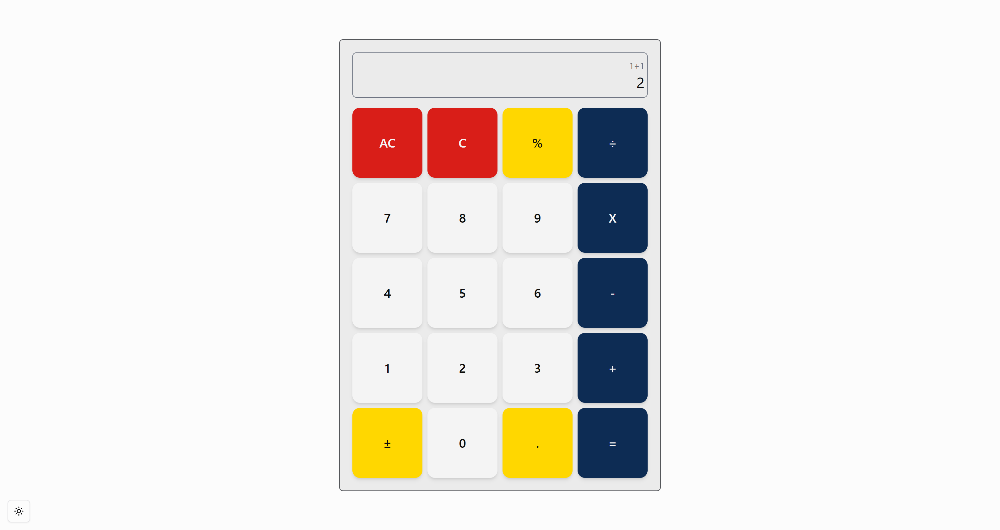
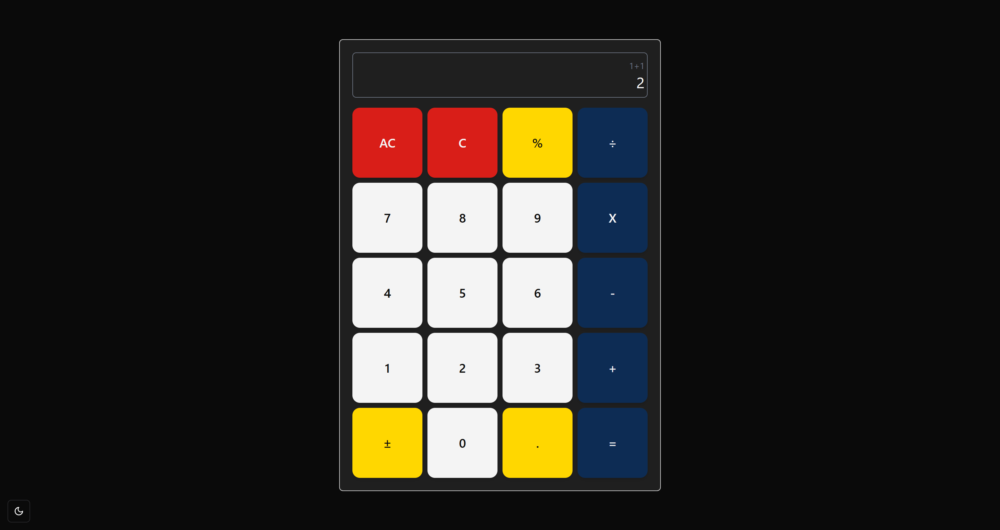

# 🧮 React Calculator with Zustand & TailwindCSS

A clean and simple calculator built with **React**, **Zustand** for state management, and **TailwindCSS** for styling. All buttons are uniformly sized in a 4x5 grid layout — no dynamic spans, just classic keypad simplicity.

---

## ✨ Features

- ✅ Responsive layout using TailwindCSS
- ✅ Zustand for clean, global state management
- ✅ Keyboard-style layout with custom button sizes
- ✅ Handles decimal input, operator chaining, and error cases
- ✅ Easily extendable (dark mode, history, memory, etc.)

---

## 🧱 Tech Stack

- **React + Vite**
- **Zustand** – lightweight state management
- **TailwindCSS** – utility-first styling
- **TypeScript**

---

## 🚀 Getting Started

git clone https://github.com/mdnazril/simple-calculator.git

cd simple-calculator

npm install
# or
yarn

npm run dev
# or
yarn dev